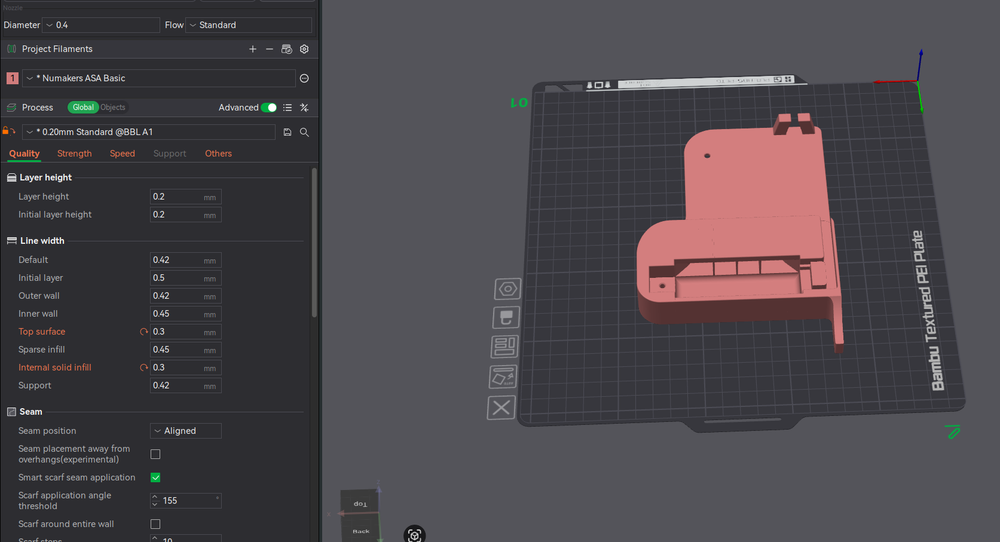
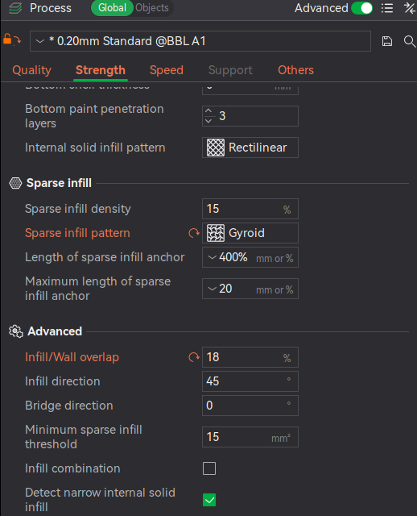
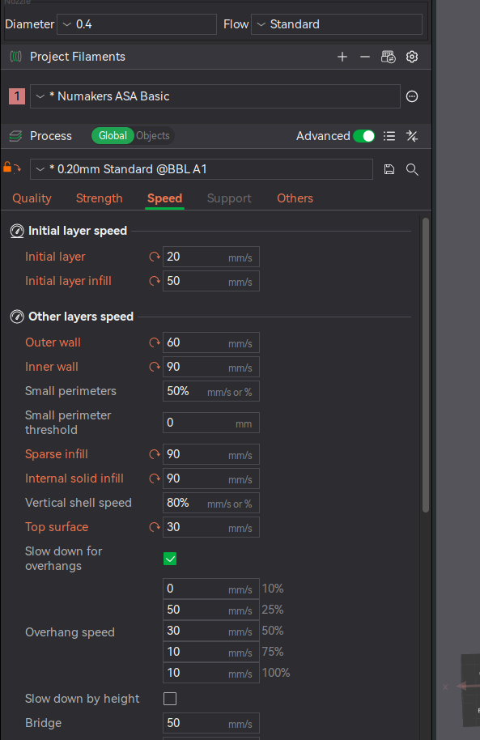
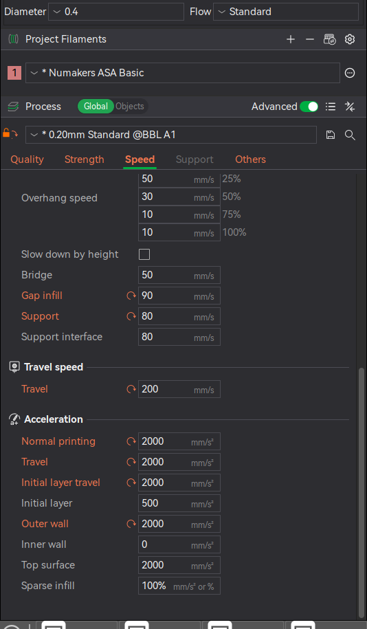
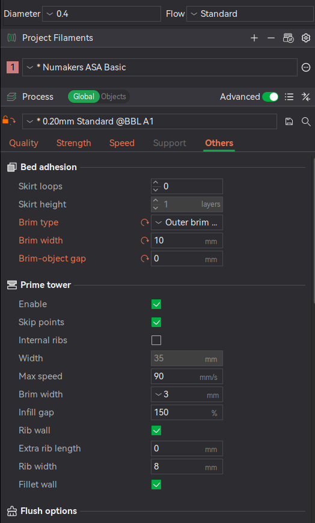
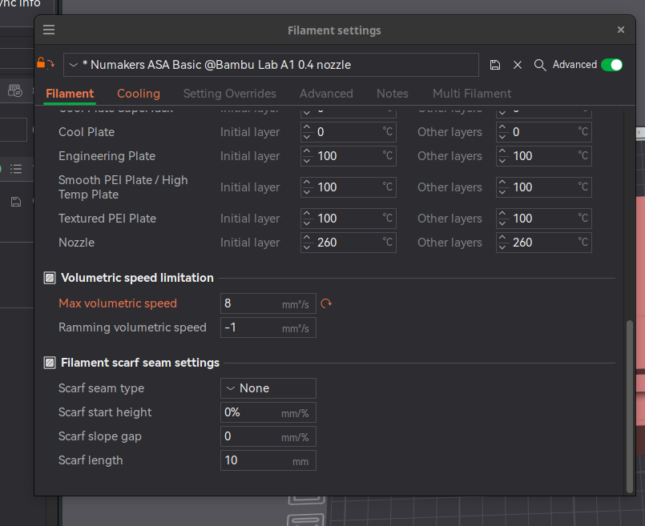
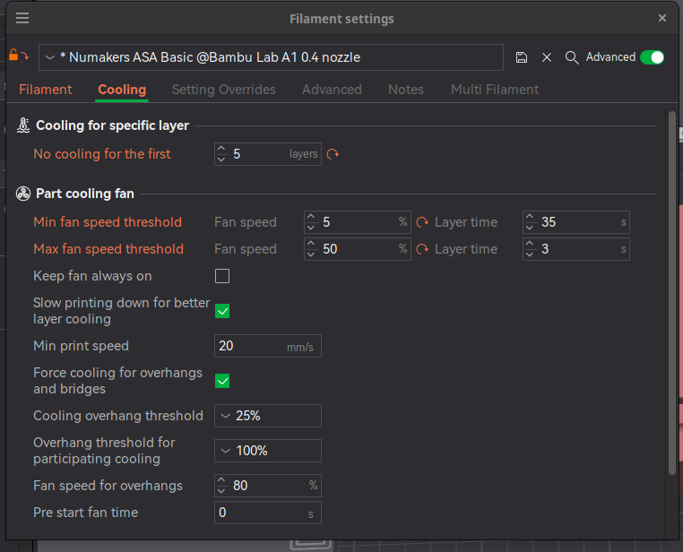
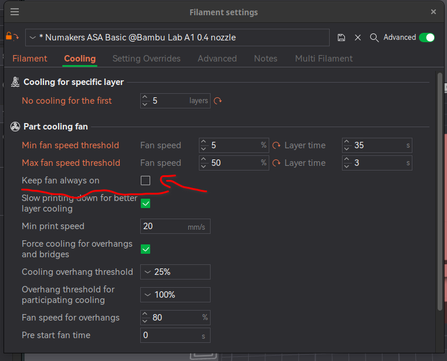

# Printing ASA on A1

## Print Settings
* use numakers cool plate and wash it properly with the soap and soft scrub.
* set the bed temp to 100, and let it soak for 30 mins or so.

## Filament settings

Keep fan always on -> unchecked 
