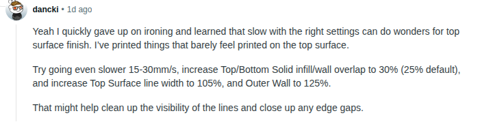

# ironing tips

use default ironing in bambu or orca. works well most of
the time but the problem is the time it takes

# without ironing

Tried the above one and saved the profile as 0.20 mm Standard @BBLA1 - very nice top surface 
It prints quite well

