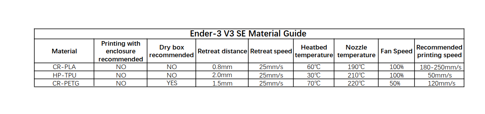

# ender 3v3 se
## material guide

## part list

- https://wiki.creality.com/en/ender-series/ender-3-v3-se
- https://wiki.creality.com/en/ender-series/ender-3-v3-se/parts-list

## pulley list

- both `x` and `y` axis uses stacked flanged idler pulleys.

`624-2z` - from https://www.reddit.com/r/Ender3V3SE/comments/1qombyt/comment/o245cth/
`624-2z` and `624-zz` are same. 
https://www.mcmaster.com/products/flanged-bearings/ball-bearings-1~/ball-bearings-1~ball-bearing-profile~flanged/shaft-diameter~4-mm/width~5-mm/bearing-seal-type~shielded/od~13-mm/
