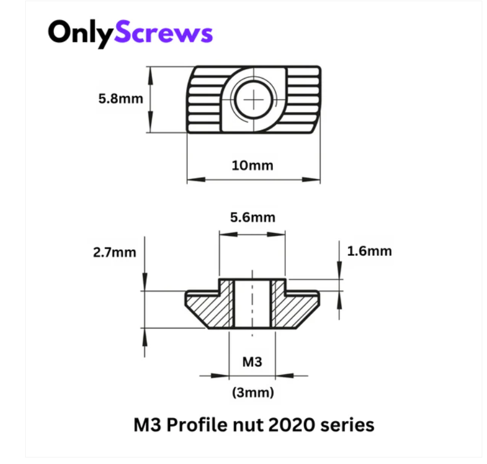

# Printed 2020 profiles

* handy for making racks for rpi or other components

M5 profiles T nuts or hammer nuts are compatible with it.

Following metal T nuts are compatible with 2020 profiles

- https://onlyscrews.in/products/m3-profile-nuts-mild-steel-with-nickel-plating-for-2020-series-t-nut-hammer-nut
- https://onlyscrews.in/products/m4-profile-nuts-mild-steel-with-nickel-plating-for-2020-series-t-nut-hammer-nut
- https://onlyscrews.in/products/m4-profile-nuts-mild-steel-with-nickel-plating-for-3030-series-t-nut-hammer-nut-1

Downloaded a t nut stl from printables and modified the hole size to 4.75 mm for the mold heat insets.
good use of those inserts for this project. 