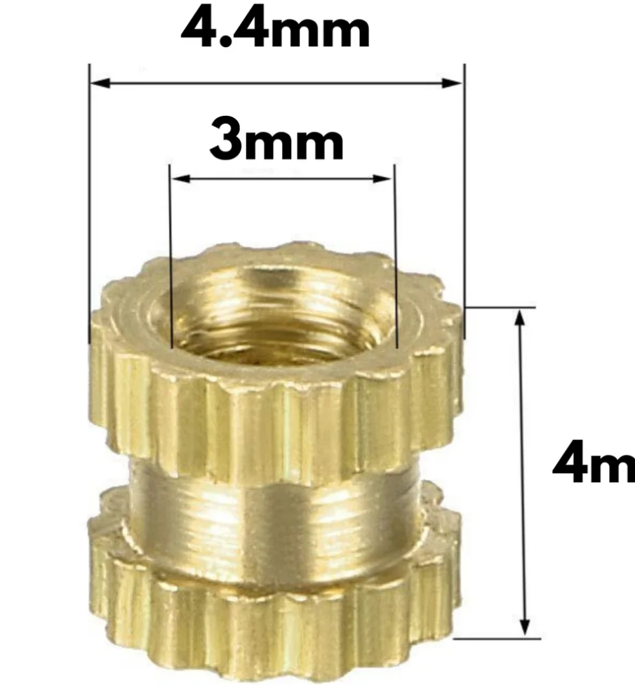
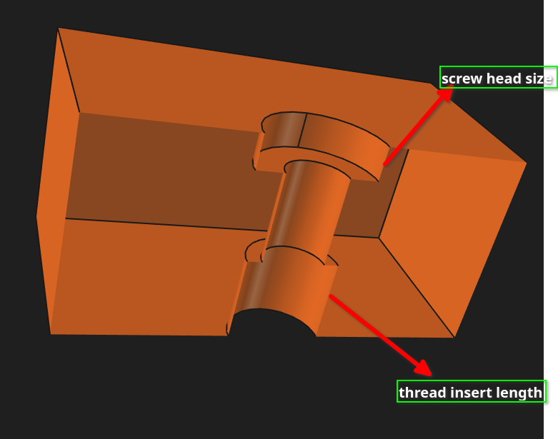
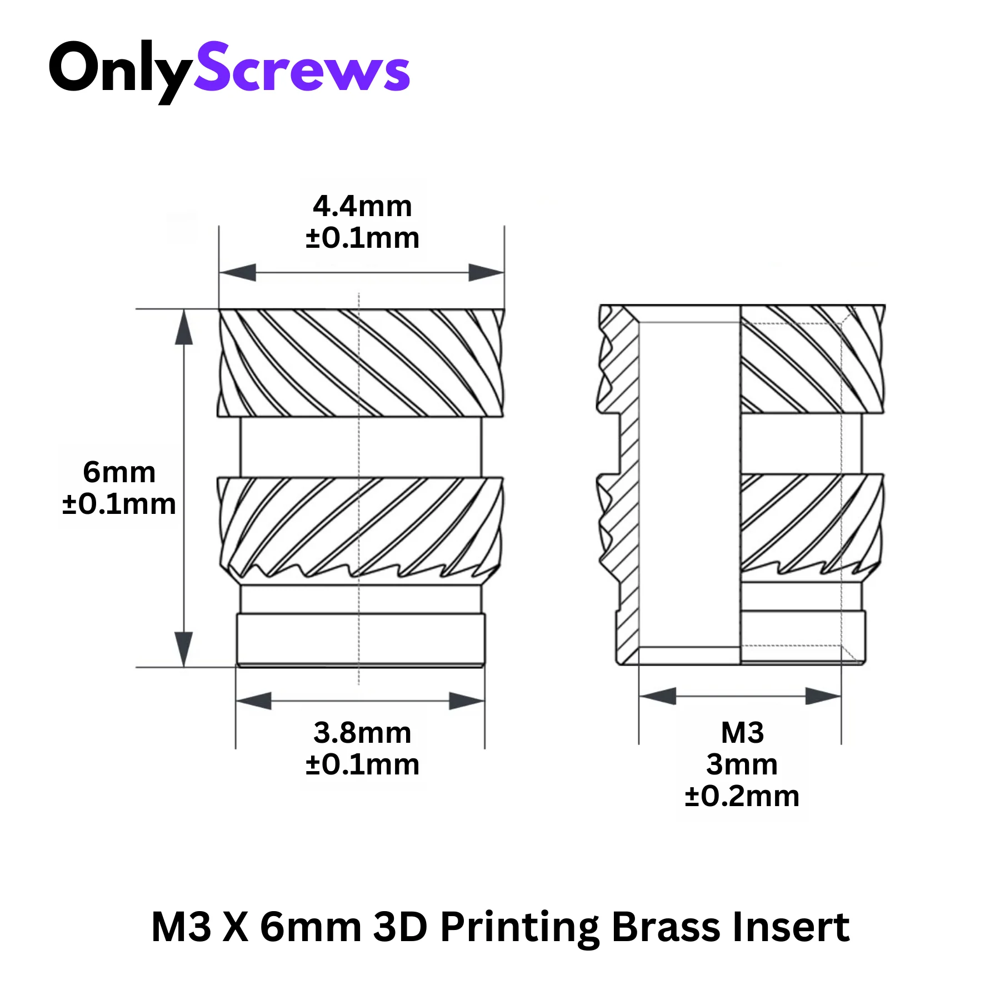

# Threaded inserts

## Design 

### Injection molding one - cheap but not good

These can be used where the high torque is not required. quite a good option
for pcb enclosure or cosmetic stuff.

#### design cosiderations: for mounting a plastic part to another part

On measuring, these are measured as `4.7 mm` in diameter instead

It is recommened to use 4.7 mm dia for fitting mold normal heat inset. Always measure them
before including them in your designs.

one example is the linear rails mount on the base of the ender 3v3 se printer. 

### the right ones - bought from dc3d.in, onlyscrews.in
These are the excellent ones, 

## Dimensions
### M3 x 4 mm - traditional inserts

These are NOT an ideal choice for 3d printed parts. It's used for moulded parts.
Since it's readily available and cheap, hence can be considered for making enclosures
for PCB projects.

### right ones for 3d printing parts

- https://onlyscrews.in/products/m3-x-6mm-3d-printing-brass-threaded-inserts-dia-3mm-length-6mm
