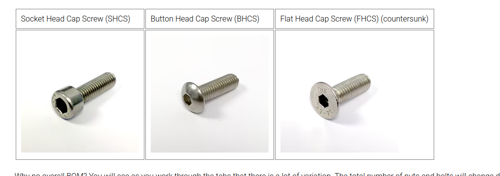

# Screws

## Types

1. SHCS (Socket Head Cap Screw) 
2. BHCS (Button Head Cap Screw)
3. FHCS (Flat Head Cap Screw)

### linear rails
which screws are used in linear rails:

#### MGN12H 
while upgrading `Ender 3v3 se` Y axis on linear rails, I used
`M3x8 mm` SCHS screws
