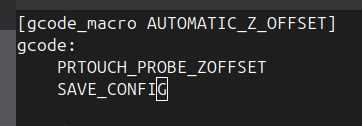

# using the load cell on ender 3v3 se

use following fork:
https://github.com/0xD34D/klipper_ender3_v3_se

this fork implements hx711s.c and dirzctl.c, which upstream does not have.

you would need to flash the firmware 

Create prtouch.cfg with contents from 0xD34D
```
ami@octoprint:~/printer_data/config $ cat prtouch.cfg 
[filter]

[dirzctl]

[hx711s]
sensor0_clk_pin: PA4             # Pressure detection clock pin
sensor0_sdo_pin: PC6             # Pressure detection data pin

[prtouch]
sensor_x: 32
sensor_y: 30
clr_noz_start_x: 15
clr_noz_start_y: 25
clr_noz_len_y: 15
s_hot_min_temp: 160
s_hot_max_temp: 200
s_bed_max_temp: 60
show_msg: True
wipe_retract_distance: 2
```

use following command

```
PRTOUCH_PROBE_ZOFFSET

```

This will calculate z offset, then run `SAVE_CONFIG` afterwards

I've a macro too



