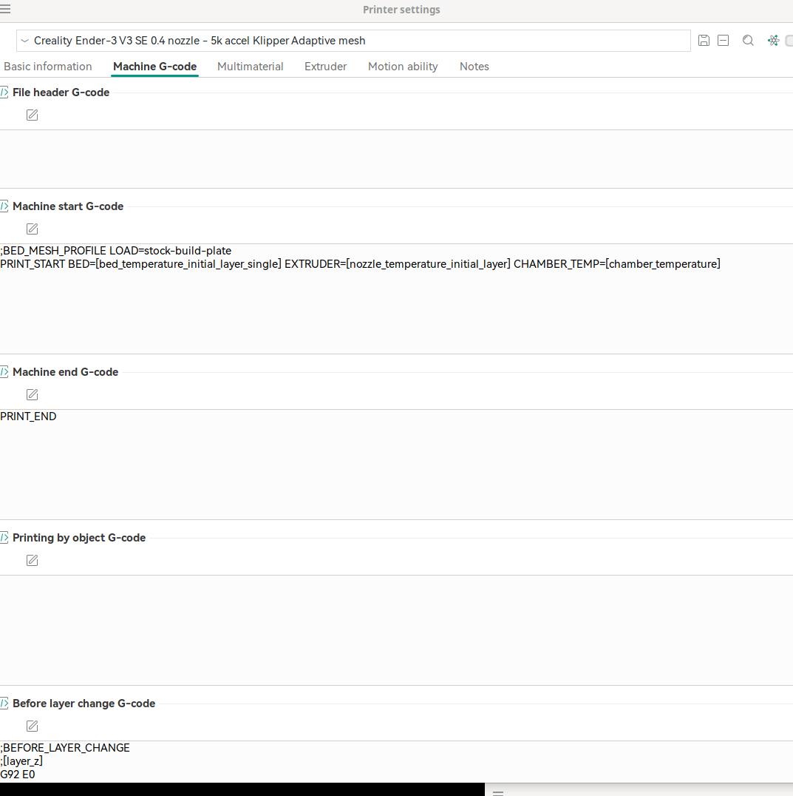
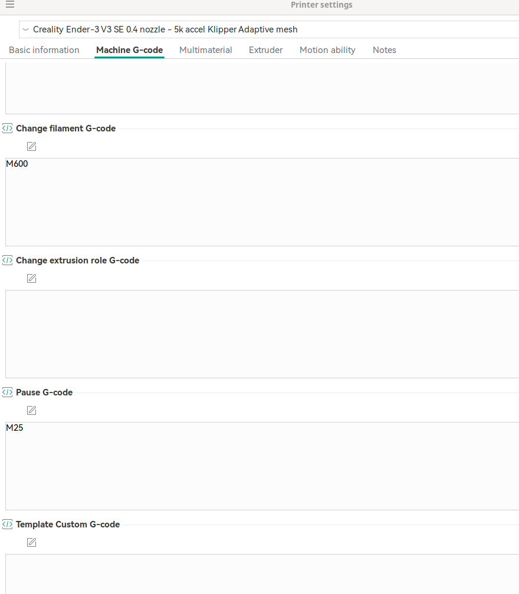

# Installation

~~https://athemis.me/projects/klipper_guide/~~
https://pblvsky.gitbook.io/ender3v3se/remote-control/klipper

In a nutshell,

we need klipper, moonraker and one of the GUIs
- fluidd
- mainsail

- moved to mainsail

make sure, you do following on rpi

```
pip install --upgrade pip setuptools wheel

```

the below might be needed in case of moonraker installation failure. 
```
pip install markupsafe
```

Use `KIAUH` to install klipper, moonraker and fluidd/mainsail

# Slicer Setup

my config: https://github.com/amitesh-singh/klipper_ender3v3se_config

repo: https://github.com/amitesh-singh/klipper_ender3_v3_se

## Start GCode in Orca Slicer

```
PRINT_START BED=[bed_temperature_initial_layer_single] EXTRUDER=[nozzle_temperature_initial_layer] CHAMBER_TEMP=[chamber_temperature]
```


## End gcode in orca slicer

```
PRINT_END

```

## Before layer change G code

```
G92 E0

```

## Change filament Gcode

```
M600
```

## Pause G code

```
M25
```
# klipper address

it's running at the port 80.


# adaptive bed mesh

Refer to [adaptive bed mesh](./bed_mesh.md)




