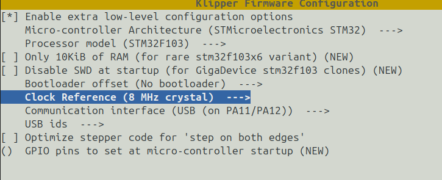

# motivation

Whole idea was to use bluepill to talk to mpu-6050 over i2c and the bluepill is plugged to
the host (RPI3).

## compiling klipper




```
cd ~/klipper
make menuconfig
< hit q and Y>
make

cd out/
st-flash write klipper.bin 0x08000000
```

Things were not smooth and aparently there was a bug in `stm32/usbfs.c`. Nomatter what I did,
the `identify` response were never recieved to the host.
I had to revert following patch.

```
:~/klipper$ git show 83ef0e135ef820f73c8579069c347953b9d6d56e
commit 83ef0e135ef820f73c8579069c347953b9d6d56e
Author: Kevin O'Connor <kevin@koconnor.net>
Date:   Thu Oct 5 00:03:07 2023 -0400

    stm32: Make sure to limit tx during usbfs startup
    
    Wait for two tx packets before startup, and make sure one of those
    packets is acked before sending a third tx packet.
    
    Signed-off-by: Kevin O'Connor <kevin@koconnor.net>

diff --git a/src/stm32/usbfs.c b/src/stm32/usbfs.c
index 0ed2e0ee..ad2e7b3e 100644
--- a/src/stm32/usbfs.c
+++ b/src/stm32/usbfs.c
@@ -255,11 +255,12 @@ usb_send_bulk_in(void *data, uint_fast8_t len)
     uint32_t epr = USB_EPR[ep];
     if (epr_is_dbuf_blocking(epr) && readl(&bulk_in_pop_flag)) {
         writel(&bulk_in_pop_flag, 0);
-        if (bipp & BI_START) {
+        if (unlikely(bipp & BI_START)) {
             // Two packets are always sent when starting in double
             // buffering mode, so wait for second packet before starting.
             if (bipp == (BI_START | 1)) {
                 bulk_in_push_pos = 0;
+                writel(&bulk_in_pop_flag, USB_EP_KIND); // Dummy flag
                 USB_EPR[ep] = calc_epr_bits(epr, USB_EPTX_STAT
                                             , USB_EP_TX_VALID);
```
and this made things work instantly

## minimal printer.cfg

reference: https://www.klipper3d.org/Config_Reference.html
learned a minimal config required for bluepill board.

```
[mcu]
serial = /dev/serial/by-id/usb-Klipper_stm32f103xe_B55B5A1A000000007A9EEE01-if00
[temperature_sensor mcu_temp]
sensor_type: temperature_mcu

[temperature_sensor my_laptop]
sensor_type: temperature_host
min_temp: 10
max_temp: 100

[output_pin status]
pin: PC13

[virtual_sdcard]
path = /home/ami/printer_data/gcodes
on_error_gcode = CANCEL_PRINT

[printer]
kinematics = none
max_velocity = 1000
max_accel = 1000
```