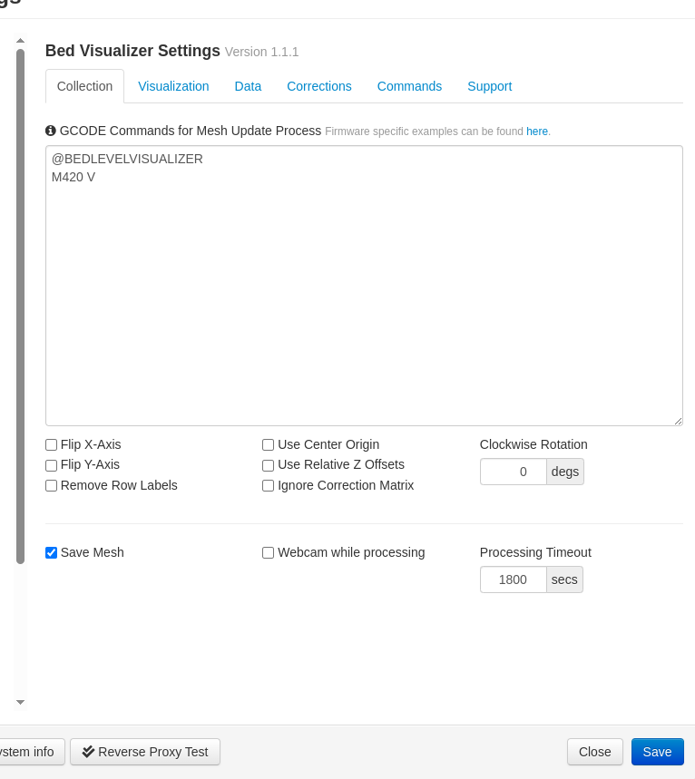
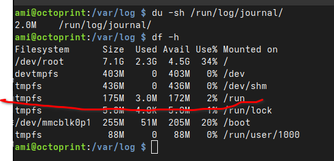

# wifi setup

The wifi service seems to be not working properly.
install wifi-start service under /etc/systemd/system/


# camera setup
- install the normal octoprint image. not the camera stack one, which did not work earlier

To verify camera, whether its working or not: 
```
raspistill -o meh.jpg

sudo camera-streamer-control restart

vim /boot/config.txt

add camera_auto_detect=1
and then reboot
```

also using sudo rasp-config to enable legacy camera stack

# plugins

## how to install plugins using pip

~/oprint/bin/pip install https://github.com/OctoPrint/OctoPrint-FileCheck/archive/master.zip

## bed visualizer plugin setup

- refer to https://github.com/jneilliii/OctoPrint-BedLevelVisualizer/
- wiki: https://github.com/jneilliii/OctoPrint-BedLevelVisualizer/blob/master/wiki/index.md

### settings

go to collection and add 
@BEDLEVELVISUALIZER 
M420 V


# writing to SD card

limit the journald logs to RAM 

```
sudo vim /etc/systemd/journald.conf

```

Add these two lines
```
Storage=volatile
RuntimeMaxUse=16M
```
```
sudo systemctl restart systemd-journald

```

This seems to work well.



