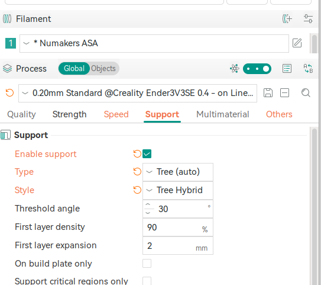
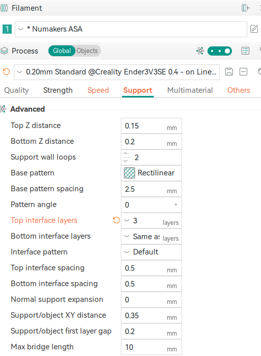
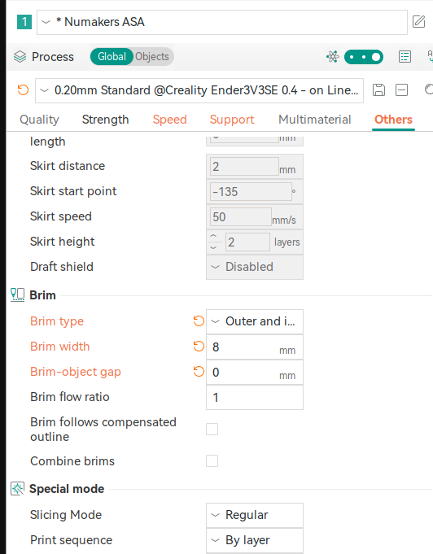

# Tips for printing numakers ABS

## First layer speed

## Support
### Support settings in OrcaSlicer
I printed a complex design (oakter router ups) which had bunch of support and I had good success with `Numakers ABS`

- [x] Enable support 
- [x] Type : Tree (Auto)
- [x] Style : Tree Hybrid

- Increasing the number of interface layers can make it easier to remove the support.

### Brim settings

