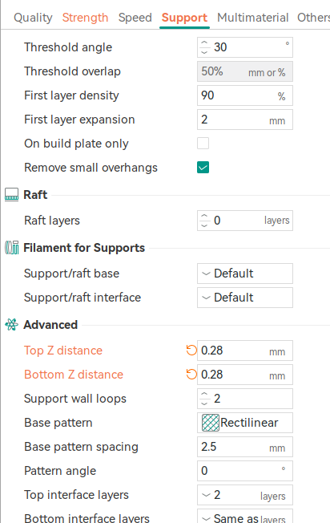
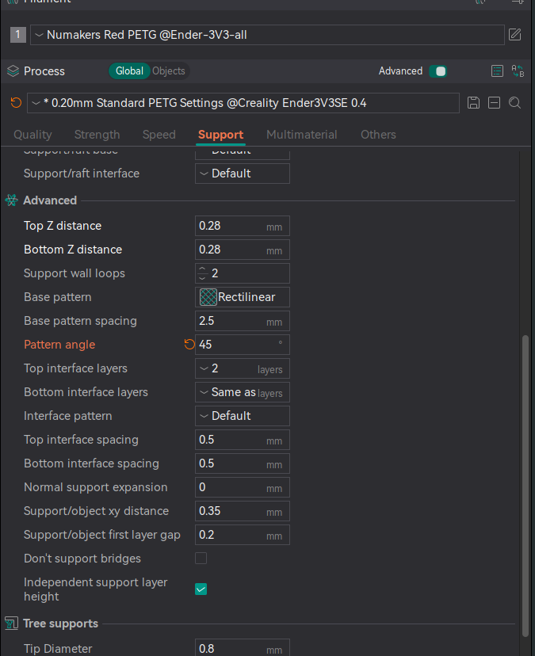

# Support

## Tips

- 0.28 Top/Bottom Z distance; 
- layer height; 0.20

0.28/0.20 = 1.4 -> constant which works well in our testing 

lets say my layer height is 0.30

in this case, the top/bottom z distance gonna be 1.4 * 0.30 = .52 

## Tree (auto) works good most of the time

### Easy removing supports for PETG
- Support -> Advance -> Top Z distance -> 0.28
- Support -> Advance -> Bottom Z distance -> 0.28 

Refer to this video too: https://www.youtube.com/watch?v=2BWQ-C-Rcic

This worked really well for Numakers PETG. 

## Advance tips

To easily remove supports, set the pattern angle to 30 or 45 degree.

