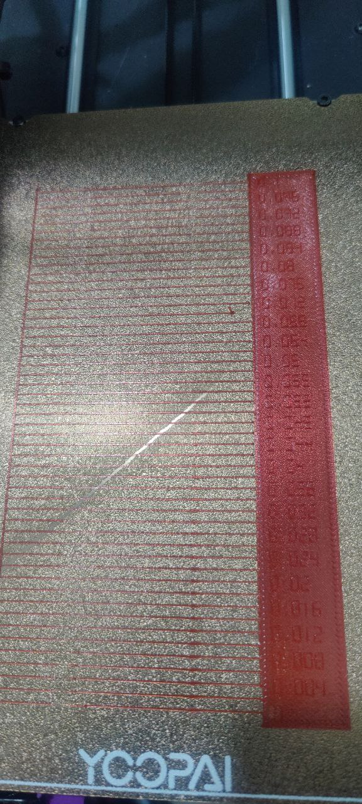

# Filament Test guide

Following orca slicer calibration tests are conducted:

## Wol3d PLA Pro+ Red

### Pressure/Linear Advance test

- 

   By looking at the image, it seems that 0.062 is a sweet spot
   Saved this settings for wol3d red pro+ into orca slicer

### Retraction Test

This test is done to avoid stringing;
- it turned out to be great from 0.3 to 1.5; set it to `1.0` mm seems to be sweet spot

### tolerance test

- 0.2 seems to be fine; 0.25 gap will be sweet spot
- 0.3 seems to be loose
- 0.4 mm is ultra loose

### max volumentric speed

I reduced it to 12mm and it yearns better results.

### flow ration

reduced it to 0.96 from 0.98.. less overflow; 

## Numaker PETG violet

### tolerance test

- 0.2 mm seems to be sweet spot
- 0.3 mm for more loose
- 0.4 mm is quite loose

## Numakers 

Following orca slicer calibration tests are conducted:

### PETG 

#### tolerance test

- 0.2 seems to be fine; 0.25 gap will be sweet spot
- 0.3 seems to be fine as well
- 0.4 mm is ultra loose

### ASA black

Calibration tests were not done
