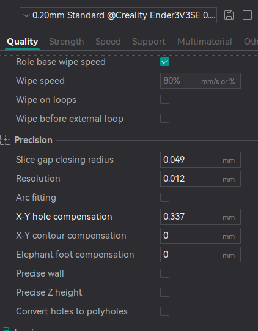

# Ender 3v3 se

## Numakers PLA+ black

### Holes Compensation

`Orca Slicer -> Quality -> X-Y Hole Compensation`

Refer to below video

https://www.youtube.com/watch?v=1O-Ho47rwLY

and 

https://makerworld.com/en/models/616958-horizontal-hole-tolerance-calibration-test#profileId-540573

On ender 3v3 se, without X-Y hole Compensation, the measured diameter was 24.3, 19.4, 14.3, 9.3,
so the difference average dia was (0.7 + 0.6 + 0.7 + 0.7)/4 

Set this value radius = (0.7 + 0.6 + 0.7 + 0.7)/4/2 = 0.337 mm in X-Y Hole Compensation

After installing linear rails on x and y axis, it turns out that we need to calibrate this option
again.

With 0.337 x-y hole compensation

- *Update* - After installing linear rails and fixing the dodgy y axis idler holder,
Set the x-y hole compensation to 0.07

## Numakers PETG bright voilet

Did the holes calibration test and I got the same results
set the X-Y hole compensation to 0.337, same as for PLA+

## Numakers ASA black

TODO

## Dream Polymers TPU 95A black

TODO

## Numakers Grey PLA Pro

### A1

On A1, the measured diamters are 9.8, 

0.2 mm around Dia hence 0.2/2 = 0.1 mm