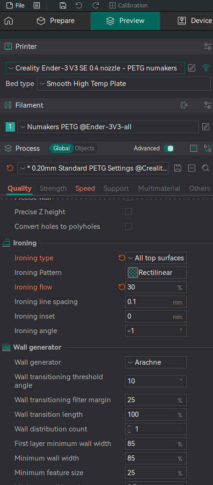
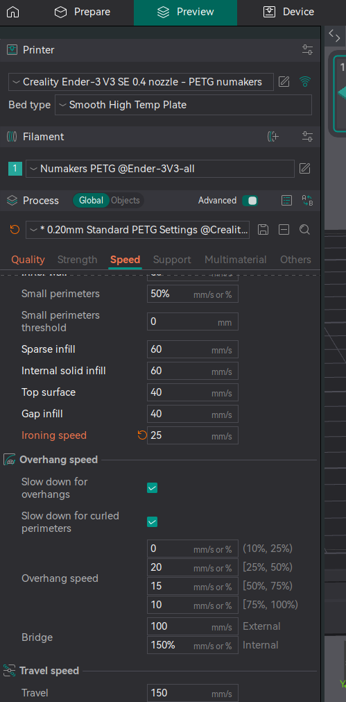

# Ironing

## ender 3v3 se

default profile works well with ender 3v3 se

## A1 
This is for getting smooth top surface.

According to the author, this is the settings for A1. I've not tested it for ender 3v3 se yet.

Refer to this

https://makerworld.com/en/models/1524973-ironing-settings#profileId-1598483

In nutshell, following settings have to be changed

30 mm/s ---> 25 mm/s
Flow: 10% ---> 30%

1.

2.

