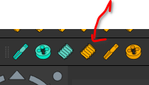
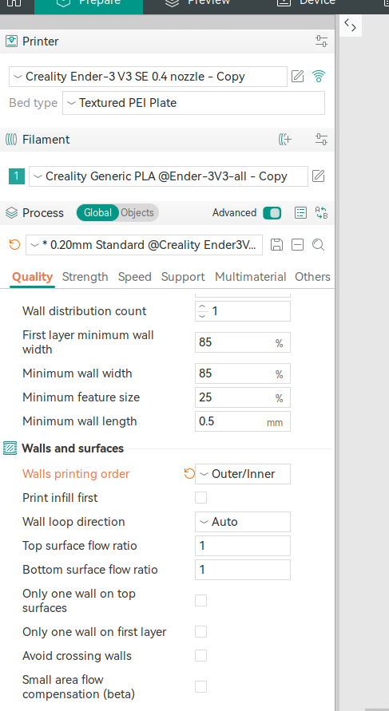

# 3dprinting nuts and bolts in freeCAD 

## creating bolts using Fastener

- use Fastener bench to create the bolt
- create Add DIN threadedrod metric threaded rod, shown below.

- go the settings of this model, and enable threaded to yes. also change the length and pitch accordingly
- go back to part design workbench and create a sketch at the top surface. create a circle with required size
- pad the circle.. for better printing.. go to sketch properties, and select attachment and set the z offset to -0.5mm

## Creating nuts using cut feature and custom screw/bolt type
- Refer to this video: https://www.youtube.com/watch?v=ojfOp16CDwQ
- Use fastener workbench and create DIN

- go the settings of this model, set the bolt type to M3 and enable threaded to yes. also change the length and pitch accordingly.
  For better results, For M3, change the Pitch to 0.75

- rest of the stuff is like below

- Now it's time to create custom stuff
- create a new 

## creating nuts using part design hole feature

Tips: 
1. Set the walls printing order to outer/inner for better accuracy (Quality -> Walls and Surfaces-> Walls printing order)
2. set the layer height to 0.16 mm if you are printing with 0.4 mm nozzle.
3. Go to edit -> preferences -> Fastener in freeCAD, and change the thread generation to `3d printer compatible`

- create a sketch on a part where you want the holes to be. just make 
    a circle on the sketch.. don't set the size as it's not needed
- close the sketch and use hole to extrude.
- select M8 or other and set the custom clearance to desired size. on ender 3v3 se, setting
  custom clearance to 1mm worked with a bolt, printed with `Walls printing order` set to `inner/outer`.
  probably, setting custom clearance to 0.5mm-0.6mm would work if both nuts and bolts are printed
  with `walls printing order` set to `outer/inner`. Nope, this is not the case. required 1 mm or may be 0.9mm

### experiments

- 1 mm custom clearance worked fine with the bolts printed with either `inner/outer` or `outer/inner`
- 0.7 mm did not work.

  It turned out that `outer/inner` always yeilds excellent dimensional accuracy for printing bolts/nuts.
 

