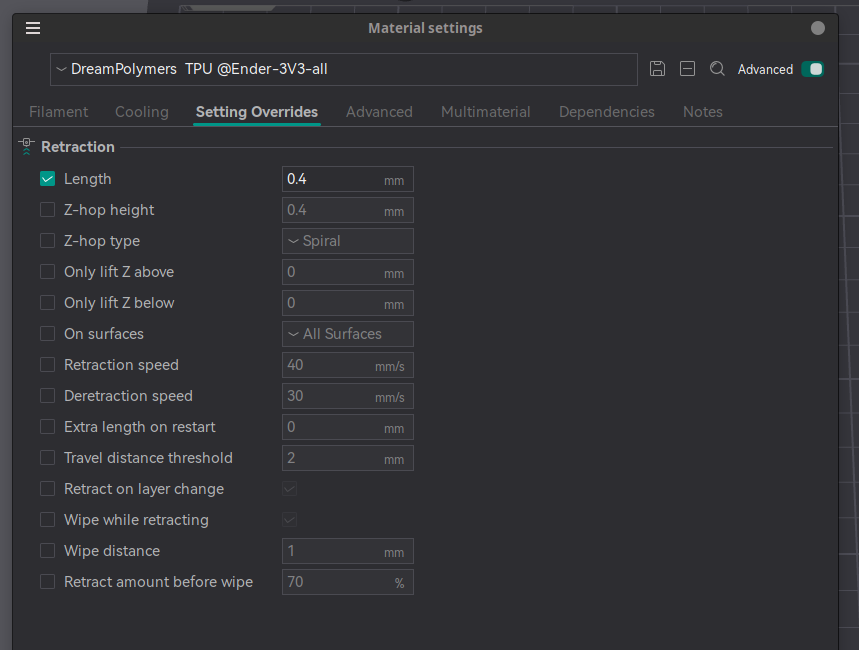

# Retraction calibration

`Calibration -> Retraction Test`

Nice guide: 
(obico guide)[https://www.obico.io/blog/retraction-test-in-orcaslicer-a-comprehensive-guide/]

## Dreampolymers TPU 95A Black

- default setting was 0.4 mm

- one of the tip, I learned from a youtube video is that
 disable the retraction, which can be done by setting the 
 Retraction length to 0.
 TODO: I still have to try it out.
 