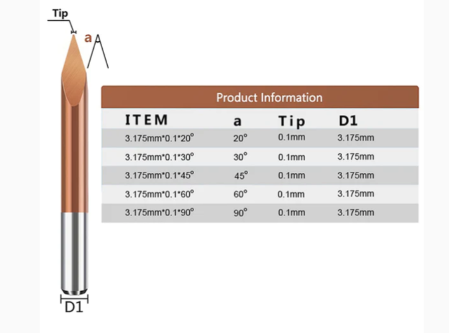
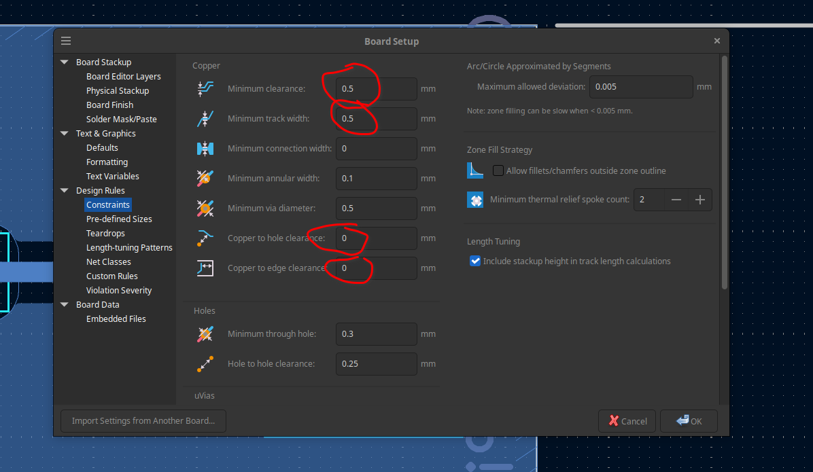
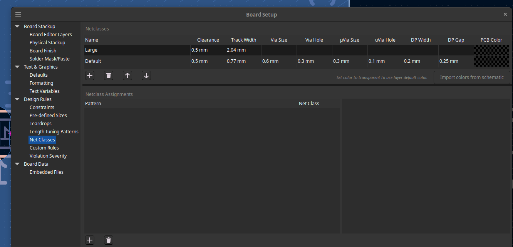
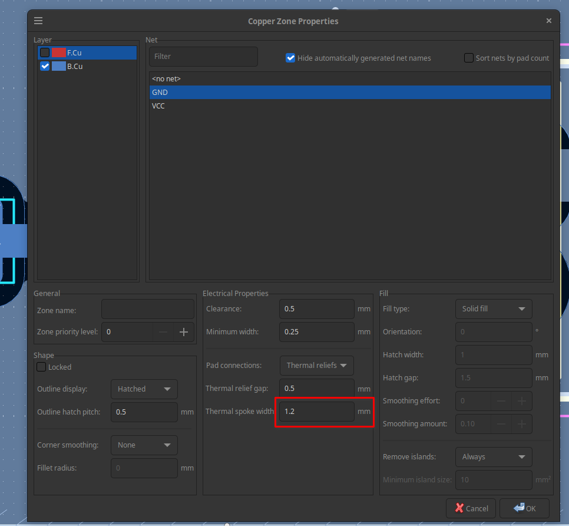
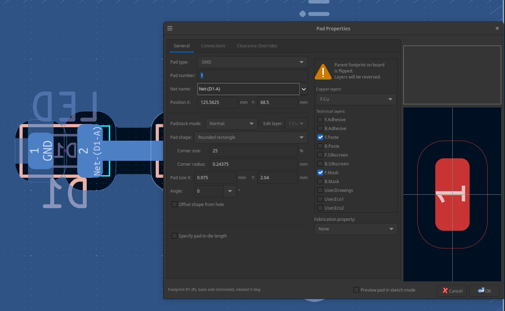
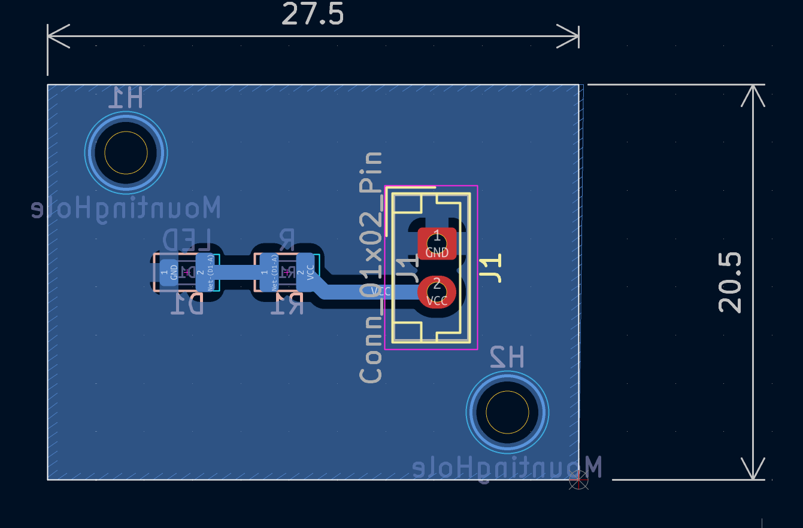

# Making PCBs
## copper clad/pcb thickness

- measured `1.3 mm-1.4 mm`

## Drilling bits details

- https://www.aeronetworks.ca/2020/03/pcb-mill.html
- mill PCBs with a 0.2 mm 45 degree V bit (which is effectively 0.4mm for z depth of 0.3mm)
- cut the outline with a 1.5 mm bit
- drill holes with a 1 mm drill bit
- For mounting holes/slots, use 1.5mm, 2.5mm or 3.175 mm drills

bought following bits from anolex

https://anolexcnc.com/products/10pcs-1-8-shank-ticn-coated-3-edge-pyramid-bit-20-30-45-60-90-degrees-0-1mm-tip



```
Copper thickness ≈ 0.035 mm
```
For a V bit:

```
cut_depth = tip + 2 * depth * tan(angle/2)
```
We decide depth based on our needs and machine capabilities

Tip here is `0.1 mm`

it's a 0.1 mm depth tip.

A bit of math given below in python for `30° V-bit @ -0.1 mm`
```
>>> import math
>>> 2 * 0.1 * math.tan(math.radians(15))
0.05358983848622454
```

| V-bit angle | Formula         | cut depth @ 0.1 mm |
| ----------- | --------------- | ----------------- |
| 20°         | 0.1 + (2d\tan(10°))   | **0.135 mm**      |
| 30°         | 0.1 + (2d\tan(15°))   | **0.154 mm**      |
| 45°         | 0.1 + (2d\tan(22.5°)) | **0.183 mm**      |
| 60°         | 0.1 + (2d\tan(30°))   | **0.216 mm**      |
| 90°         | 0.1 + (2d\tan(45°))   | **0.300 mm**      |

In `pcb2gcode` milliproject, use 

```
zwork = -0.1
mill-diameters = 0.154   # 30° V-bit + 0.1 mm tip
```
#### Tips
- Smaller angle → finer isolation, more Z sensitivity
- Larger angle → wider cut, more forgiving to board warp

- For warped boards:
60° or 90° + probing = easiest

- For fine SMD:
20°–30° + probing = best quality

Cut in a puddle of oil.  Good old 3 in 1 machine oil works wonders.  Spread it with a tooth pick.  It keeps the bits sharp and cold and prevents burrs.  It also prevents the dust from taking flight.  Wipe up with a rag and brush with a tooth brush and tooth paste under running water - yes, toothpaste works wonderful to clean an oily board!

## Kicad

### kicad board setup

Do this before starting the work.

#### Constrains

`File -> Board Setup`
- Min clearance: 0.5 mm
- min track width: 0.5 mm
- copper to hole clearance: 0 mm
- copper to edge clearance: 0 mm



#### Net Classes

- “Default”
  Clearance: 0.5 mm
  Track width: 0.77 mm

- “Large” (add new)
  Clearance: 0.5 mm
  Track width: 2.04 mm


#### Thermal relief 
- set it to 1.2 mm



#### Pad size

depending upon the orientation 

- x - set it default. 
- y - 2.04 mm 



### Origin in freecad

set the grid and drill origin to right-bottom side.



## pcb2gcode: exporting gerber to gcode

create a output file and dump gerber and drl files there:

board thickness is `1.3 mm`
`led` is the project name

```
back=led-B_Cu.gbr
drill=led.drl
outline=led-Edge_Cuts.gbr

# Generic
metric=true         # use metric units for parameters
metricoutput=true   # use metric units for output
nog64=true          # do not set an explicit g64
nom6=true           # do not emit m6
zsafe=2             # The height in mm at which the bit can move freely without obstruction
zchange=35          # Tool changing height in mm
output-dir=./

# Place a 5x7cm board in the lower right quadrant of the coordinate system
# This will allow you to probe the fixed jaw of the vise for (0,0) on the CNC.

# I've disabled this and rely on setting the origing to the right-bottom side in kicad
#mirror-axis=6.275    # set this to half of your board width

# Drilling
zdrill=-1.7        # drilling depth = -[board thickness + 0.4]
drill-feed=200      # Vertical mm/min feed
drill-speed=24000   # Spindle RPM
onedrill=true       # Use a single drill for all holes
nog81=true          # replace G81 with G0+G1 (no G81 in GRBL)
# IMPORTANT for making mounting holes with a 1mm drill bit 
milldrill=true
milldrill-diameter=1.0

# Milling
zwork=-0.1          # V-bit plunge depth, copper thickness = 0.035mm
#mill-diameters=0.11 # 60 deg V-bit dia at -0.1 plunge depth
#mill-diameters=0.08 # 45 deg V-bit dia at -0.1 plunge depth
mill-diameters=0.15 # 30 deg V-bit dia at -0.1 plunge depth
mill-speed=24000    # Spindle RPM
mill-feed=600       # Horizontal feedrate in mm/min
mill-vertfeed=100   # Plunge rate in mm/min
voronoi=true        # cuts the milling time significantly, but check with this on and off if everything looks ok
preserve-thermal-reliefs = true # has effect only if voronoi=true

# Cutting
zcut=-2.5 # -[board_thickness + 0.2] mm
cutter-diameter=2
cut-feed=80
cut-infeed=100
cut-speed=24000
cut-side=back

```

### pcb2gcode documentation 

- Refer to https://github.com/pcb2gcode/pcb2gcode/wiki/Manual

```
--front filename.gbr
Engrave the front side according to the given file (typically used in two-sided boards).

--back filename.gbr
Engrave the back side according to the given file.

--outline filename.gbr
Cut out the board to the shape exposed in the given file. Typically, there is only a polygon in this gerber file. Alternatively, this file can contain a closed line chain (see --fill-outline).

--drill filename.cnc
Convert the given file (containing drill sizes and positions) to G-code.


```


- ./generate_mill.sh

```
#!/bin/bash

docker run --rm -i -t -v ".:/data" ptodorov/pcb2gcode

cat back.ngc > combined.ngc
cat drill.ngc >> combined.ngc
cat outline.ngc >> combined.ngc

```


## how to simulate 

you can combine both `back.ngc` and `drill.ngc` to check if everything is working fine
- https://harvie.github.io/cnc-simulator
  set the bit diameter to 0.3, and angle to 180

- https://ncviewer.com/


- 
## Links
- https://mateusznowak.dev/articles/manufacturing-pcb-at-home/
- https://peterprototypes.com/blog/pcb2gcode/
- https://mike-ensor.medium.com/first-homemade-pcb-33392c511d83
- https://bdharva.com/blog/2020/02/18/getting_started_with_desktop_cnc.html
- https://github.com/vika-sonne/FlatCAM/releases/tag/v2024.4
